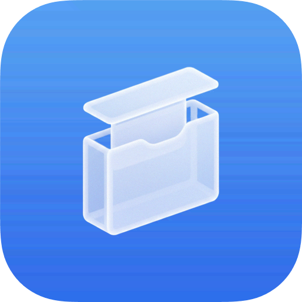

**Laterfeed** lets you save articles and videos to read or watch later.<br>
It exposes your saved links as an <a href="<https://en.wikipedia.org/wiki/Atom_(web_standard)>)">Atom feed</a>, so you can consume them in any RSS reader.<br>
There's also a Chrome extension for saving pages directly from the browser.

<br>

## Features

- Save articles and videos with a single API call
- Automatic metadata extraction (title and description) from saved URLs
- Atom feed generation for use with any RSS reader
- Chrome extension for one-click saving from the browser
- OpenAPI documentation with interactive Scalar UI at `/docs`
- Simple token authentication
- SQLite database - no external dependencies

## Getting Started

### Run with Docker (Recommended)

Generate an authentication token using this method or any other method that you prefer:

```bash
openssl rand -hex 32
```

Run the container:

```bash
docker run -d -p 8000:8000 \
  -v $(pwd)/data:/data \
  -e PORT=8000 \
  -e DATABASE_URL=sqlite:/data/data.db \
  -e BASE_URL=http://localhost:8000 \
  -e AUTH_TOKEN=changeme \
  reaperberri/laterfeed:latest
```

Laterfeed is configured via environment variables:

| Variable       | Description                                   | Example                 |
| -------------- | --------------------------------------------- | ----------------------- |
| `PORT`         | Port the server listens on                    | `8000`                  |
| `DATABASE_URL` | SQLite connection string                      | `sqlite:data.db`        |
| `BASE_URL`     | Public URL of the server (used in feed links) | `http://localhost:8000` |
| `AUTH_TOKEN`   | Bearer token for authenticated endpoints      | `changeme`              |

## API Routes

| Method | Path       | Auth | Description                       |
| ------ | ---------- | ---- | --------------------------------- |
| `GET`  | `/health`  | No   | Health check                      |
| `GET`  | `/feed`    | No   | Get saved entries as an Atom feed |
| `GET`  | `/entries` | No   | List all entries as JSON          |
| `POST` | `/entries` | Yes  | Add a new entry                   |
| `GET`  | `/docs`    | No   | Interactive OpenAPI documentation |

## Development

Requires [Rust](https://www.rust-lang.org/tools/install) and [just](https://github.com/casey/just).

Copy `.env.example` to `.env` and update the values where necessary.

Run:

```bash
just migrate-up
just run
```
